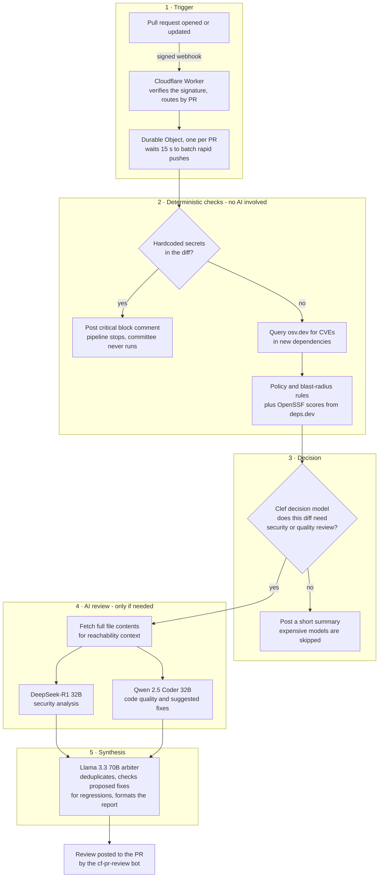

# Automated AI Code Review on Cloudflare Workers

An automated pull-request review agent that runs entirely on Cloudflare's free tier. When a PR is opened where the `cf-pr-review` GitHub App is installed, a signed webhook triggers a pipeline that scans for leaked credentials, checks new dependencies against live CVE data, and — when the change warrants it — posts a multi-model AI review back to the PR as `cf-pr-review[bot]`. No server, no cron, no idle cost.

Built during ClawBuilders S1:E5 — [Deploy AI Agents with Cloudflare](https://clawbuilder.club/events/s1/ep5/deploy-ai-agents-with-cloudflare) — on the [ClawBuilders cloudflare-code-reviewer](https://github.com/Clawbuilders/cloudflare-code-reviewer) reference architecture. My deployment work and changes to the design are listed under [My changes](#my-changes-to-the-reference-architecture); the open PRs referenced below are real reviews produced by this deployed system.

## How it works

The Worker verifies each webhook's HMAC-SHA256 signature and routes it to a Durable Object scoped to that PR, which debounces rapid pushes so five commits produce one review. Deterministic gates run before any model call — a leaked key never depends on an LLM noticing it — and real CVE or policy findings always force a security pass, so the triage decision can add scrutiny but never remove it. When specialists run, the security model receives full file contents, not just the diff, so it can judge whether a flaw is actually reachable. Every review lands on the PR and in a SQLite audit table inside the Durable Object: a blocked PR completes in ~16 s, a full committee review in ~35–55 s.

## The security suite

| # | Check | Kind | What it does |
|---|---|---|---|
| 1 | Secret scan | heuristic | gitleaks-style regex ruleset (AWS, GitHub, OpenAI, Stripe, Slack, npm and other token shapes) — any hit blocks the PR immediately |
| 2 | osv.dev lookup | live API | new `package.json` dependencies batch-queried for known CVEs — real advisory IDs |
| 3 | File filter | heuristic | lockfiles, YAML, markdown, vendored paths never reach the models |
| 3.5 | Triage gate | decision model | `@cf/cloudflare/clef` decides which specialists run, with calibrated confidences |
| 4 | Policy gate | heuristic | flags CI-workflow, auth, and infra-config changes; warns on oversized PRs |
| 5 | Reachability context | live API | full file contents fetched from GitHub so flaws are judged reachable, not just pattern-matched |
| 6 | Regression check | model instruction | the arbiter must verify proposed fixes introduce no secondary vulnerabilities |
| 7 | OpenSSF Scorecard | live API | new dependencies scored via deps.dev (maintenance, review practices, branch protection) |

Workers are V8 isolates and cannot execute native binaries, so the heuristic rows are deliberate JavaScript re-implementations of the named tools' rules — the live rows call real public APIs. The worker's landing page renders the same breakdown.

## The models — all free tier

| Model | Role |
|---|---|
| `@cf/cloudflare/clef` (27B decision model, Apache 2.0) | Triage: calibrated security/quality probabilities and change category |
| `@cf/deepseek-ai/deepseek-r1-distill-qwen-32b` | Security specialist — reachability-oriented analysis with full-file context |
| `@cf/qwen/qwen2.5-coder-32b-instruct` | Quality specialist — correctness findings with suggested fixes |
| `@cf/meta/llama-3.3-70b-instruct-fp8-fast` | Lead arbiter — dedupe, regression checklist, final formatting |

All four are first-party Workers AI models billed in Neurons. A full committee review costs roughly 800–1,000 of the 10,000 free daily Neurons — about ten deep reviews per day, plus hundreds of triage-only ones, since in the verification run Clef classified a notes-only PR as documentation at 0.02 security / 0.09 quality confidence and the committee never ran. If the allocation runs out, model calls return 429 until it resets at 00:00 UTC.

## What the PRs in this repo show

| PR | Change | Path | Result |
|---|---|---|---|
| [#1](https://github.com/akshatdodhiya/ai-code-review-agent/pull/1) | Fixtures with inert, publicly documented example credentials | Secret gate | Critical block naming the credential types; committee never invoked (~16 s) |
| [#2](https://github.com/akshatdodhiya/ai-code-review-agent/pull/2) | Known-vulnerable dependency pins | Full committee, forced by live CVEs | Synthesized review posted; predates the Clef migration, so the comment carries the visible fallback notice from when the original paid triage model was unavailable (~36 s) |
| [#3](https://github.com/akshatdodhiya/ai-code-review-agent/pull/3) | Vulnerable deps plus utility code with real defects | Full committee | Complete review — security, policy, dependency, supply-chain and quality findings, numbered fixes, corrected example code (~53 s) |
| [#4](https://github.com/akshatdodhiya/ai-code-review-agent/pull/4) | Notes-only file | Triage gate | Classified documentation (0.02 / 0.09 confidence); specialists skipped (~16 s) |

The credential strings in PR #1 are published example values and were never valid.

## My changes to the reference architecture

- **Deployed end-to-end and verified behaviorally.** Worker and Durable Objects, GitHub App registration with least-privilege permissions (Contents: read; Pull requests: read/write), PKCS#8 key handling, Wrangler secrets, webhook signature validation — every pipeline path exercised with targeted PRs rather than trusting a successful deploy.
- **Removed the only paid dependency.** The reference routes triage through `typesafe/jev`, a third-party decision model billed via AI Gateway credits with no free tier. I replaced it with `@cf/cloudflare/clef` — Cloudflare's first-party, Apache-2.0 decision model, released the same day — while keeping a text-model fallback and a fail-open tier beneath it, so a triage failure can never silently drop a review. Every model call now runs inside the free Neurons allocation.
- **Fixed truncated reviews.** The arbiter inherited the platform's 256-token default output cap, cutting reports mid-sentence; raised to 2048.
- **Verified private-repository operation.** Diffs come from the authenticated REST API, because GitHub's `.diff` web route rejects App tokens on private repos. This sandbox was private throughout development.

## Limitations

- The secret scan is pattern-based, not entropy-based — it catches well-shaped secrets, not all secrets.
- Dependency analysis parses `package.json` only (no lockfiles), ten packages max; full-file context caps at two files × 4k characters.
- osv.dev findings feed the arbiter rather than the security specialist, so advisories and code-level analysis are synthesized rather than cross-examined.
- If a specialist call itself throws, that review is not posted (logged via `wrangler tail`) — the one bounded gap in the fail-open chain.
- Free tier: sustained volume beyond ~10 committee reviews per day exhausts the Neuron allowance until 00:00 UTC.

## Credits

Based on the [ClawBuilders cloudflare-code-reviewer](https://github.com/Clawbuilders/cloudflare-code-reviewer) reference architecture, which credits Alibaba's open-code-review as its design inspiration. The deployment changes above are my own.

Agent: `cf-pr-review[bot]` (App ID 5156105) · Worker: `cloudflare-code-reviewer.akshat-personal.workers.dev`
