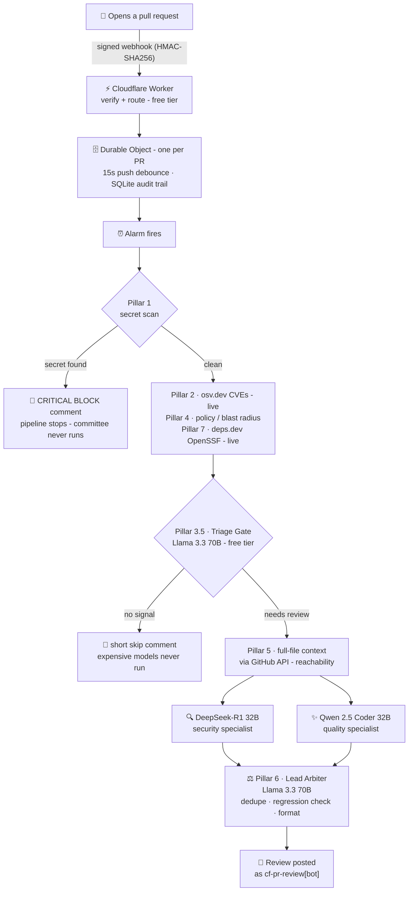

# 🤖 cf-pr-review — an AI code reviewer living on the Cloudflare edge

> **Live demo sandbox.** Every pull request opened in this repo is automatically reviewed — in under a minute — by a multi-model AI security pipeline running on Cloudflare Workers. There is no server: the whole thing is serverless, event-driven, and costs **$0**. This page is the guided tour.

**Stack** — Cloudflare Workers · Durable Objects (SQLite) · Workers AI (free tier) · GitHub App webhooks · osv.dev · deps.dev

**Base** — the [ClawBuilders cloudflare-code-reviewer](https://github.com/Clawbuilders/cloudflare-code-reviewer) reference architecture (inspired by Alibaba's open-code-review), deployed end-to-end from scratch, **with one deliberate modification**: the triage gate was moved off the paid `typesafe/jev` decision model onto the free first-party **Llama 3.3 70B**, so the entire pipeline runs on the free tier — no paid-model dependency anywhere.

**Worker (visit it live)** — `https://cloudflare-code-reviewer.akshat-personal.workers.dev`
**Bot identity** — `cf-pr-review[bot]`, a real GitHub App (ID 5156105) with least-privilege permissions

---

## 🎬 The 30-second pitch (read this aloud)

Someone opens a PR. GitHub fires a **signed webhook** into a **Cloudflare Worker** — no server, no VM, no cron, no polling. A **Durable Object** — a tiny stateful actor, one per PR — debounces pushes for 15 seconds. Then the diff runs through a **7-pillar security pipeline**: hardcoded-secret scanning, live CVE lookups, supply-chain scoring, policy gates. A **triage model** decides whether the expensive AI specialists are needed at all. If yes: a **DeepSeek-R1 security auditor** and a **Qwen 2.5 Coder quality reviewer** analyze in parallel, then a **Llama 3.3 70B arbiter** deduplicates, runs a regression checklist, and formats the verdict. The bot posts the review back on the PR, and every review is written to a SQLite audit trail inside the Durable Object.

## 🗺️ Architecture

## 🧩 The parts

| Part | What it is | Why it's there |
|---|---|---|
| GitHub App | `cf-pr-review`, posts as `cf-pr-review[bot]` | Bot identity with least-privilege scopes: Contents **read**, Pull requests **read/write** — nothing else |
| Cloudflare Worker | Stateless ingress | Verifies every webhook's HMAC-SHA256 signature, filters to `pull_request` events, routes each PR to its own Durable Object |
| Durable Object | `PrReviewCoordinator`, one per PR, SQLite-backed | 15-second push debounce (push 5 commits, get 1 review); runs the pipeline in an alarm handler; keeps the `reviews` audit table |
| Workers AI | 4 models, all free tier | Division of labor — see below |
| osv.dev + deps.dev | Live public APIs | Real CVE data + OpenSSF supply-chain scores — no keys, no binaries |

**The auth chain** (a good demo beat): the App's PKCS#8 private key → signed JWT → exchanged for a 1-hour installation token → used to fetch diffs and post comments. Web Crypto only, zero auth libraries.

## 🛡️ The 7-pillar security suite

| # | Pillar | Kind | What it does |
|---|---|---|---|
| 1 | Secret scan (gitleaks-pattern) | heuristic | 13 regexes: AWS/GitHub/OpenAI/Stripe/Slack/npm keys, private key blocks. **Hit = instant block, pipeline stops** |
| 2 | osv.dev vulnerability lookup | **REAL** | New `package.json` deps batch-queried live — real CVE/GHSA IDs |
| 3 | Hard-rails file filter | heuristic | Lockfiles, YAML, markdown, dist/vendor never reach the models — token savings |
| 3.5 | Triage gate | free tier | Llama 3.3 70B decides: security? quality? both? neither? Docs-only PRs skip the committee entirely |
| 4 | Policy / blast-radius gate | heuristic | Flags `.github/workflows/`, `auth/`, `wrangler.json` changes; >15 files = split-your-PR warning |
| 5 | Reachability context | **REAL** | Pulls **full file contents** (not just the hunk) via the GitHub API so the security model judges *reachability*, not just patterns |
| 6 | Regression check (OWASP-ASRH-style) | heuristic | The arbiter is instructed to verify proposed fixes introduce zero secondary vulnerabilities |
| 7 | OpenSSF Scorecard | **REAL** | New deps scored via deps.dev — maintenance, review practices, branch protection |

**The honesty layer:** Workers are V8 isolates — they cannot execute native binaries (no real gitleaks/semgrep/opa). Pillars marked **REAL** call live public HTTP APIs; heuristic ones are honest JS re-implementations of the named tool's *idea*. The worker's landing page renders this same breakdown with badges.

## 🤖 The AI committee — division of labor

| Model | Role | Why this model |
|---|---|---|
| Llama 3.3 70B | Triage gate | Cheap classifier in front of expensive models — the cost cascade |
| DeepSeek-R1 Distill 32B | Security specialist | Reasoning model doing Mantis-style *reachability* analysis |
| Qwen 2.5 Coder 32B | Quality specialist | Code-specialized; emits suggestion blocks |
| Llama 3.3 70B | Lead arbiter | Dedupes, kills false alarms, enforces the regression checklist, formats |

## ⏱️ What happens when you open a PR (measured in this repo)

| t | Event |
|---|---|
| ~0s | Signed webhook hits the Worker; HMAC verified; routed to the per-PR Durable Object |
| 0–15s | Debounce window — keep pushing and the alarm keeps resetting |
| 15s | Alarm fires: fetch diff → Pillar 1 secret scan |
| 15s+ε | **If a secret is found: 🚨 critical block comment posted, done** (~16s end-to-end) |
| ~15–25s | osv.dev CVEs · policy gate · deps.dev scorecard · triage decision |
| ~25–50s | Committee: DeepSeek-R1 ∥ Qwen (only the ones triage approved), then the arbiter |
| ~35–55s | Review posted by `cf-pr-review[bot]` + row inserted in the SQLite audit table |

## 🧪 Live artifacts — the three code paths (all real, all in this repo)

| PR | Contents | Path taken | What the bot did | Time |
|---|---|---|---|---|
| [#1](https://github.com/akshatdodhiya/code-reviewer-test/pull/1) | Fake AWS key + fake GitHub PAT (publicly documented example strings) | 🛑 Pillar 1 emergency brake | 🚨 `CRITICAL SECURITY BLOCK` — named the exact credential types ("GitHub Token, AWS Access Key ID"), told the author to revoke and purge git history. The AI committee never ran — the deterministic gate didn't need it. | **16s** |
| [#2](https://github.com/akshatdodhiya/code-reviewer-test/pull/2) | `lodash@4.17.15` + `request@2.88.0`, no secrets | Full committee (forced by real CVEs) | osv.dev found real advisories → **forced** the security specialist on → committee posted the synthesis. This run also caught a **visible degradation**: the paid triage model was unavailable, the posted comment *said so*, and the free-tier fallback kept the pipeline alive — proof that degraded runs are never silent. | **36s** |
| [#3](https://github.com/akshatdodhiya/code-reviewer-test/pull/3) | Vulnerable deps + a utilities file with real bugs | Full committee, post-swap — **$0 all the way down** | Complete review with every badge section — [SECURITY] (NPE in `formatUser`, unsafe fetch, retry without backoff), [POLICY] (`var` usage), [DEPENDENCY] (6 lodash advisories, 1 request), [SUPPLY-CHAIN] (low OpenSSF checks), [CODE QUALITY] (`for...in` without `hasOwnProperty`) — plus a numbered fixes list and corrected example code. | **53s** |

## 🎤 Talking points

- **It's event-driven serverless.** Nothing runs until a PR happens. No idle servers, no cron polling GitHub, no queue infrastructure.
- **The debounce is a Durable Object.** Push five commits in ten seconds, get one review — the alarm resets per push. One DO per PR also serializes reviews naturally, no locks needed.
- **Deterministic before probabilistic.** The regex/CVE/policy gates run *before* any model call — a hardcoded AWS key never depends on an LLM noticing it.
- **Triage can only add scrutiny, never remove it.** If osv.dev or the policy gate found something real, the security specialist runs no matter what the triage model says.
- **Degradation is visible, never silent.** If a tier fails, the pipeline fails *open* (runs the full committee) and the posted comment says exactly which tier was unavailable.
- **This sandbox is a private repo — and the bot handles it fine.** The diff is fetched via the authenticated REST API with the App installation token (the `.diff` web route 404s for App tokens on private repos — a real deployment gotcha that was debugged and fixed here).

## 💸 What it costs

| Component | Plan | Cost |
|---|---|---|
| Cloudflare Worker | Free tier — 100k req/day | $0 |
| Durable Object (SQLite) | Free tier | $0 |
| Workers AI — all 4 models | Free Neurons allowance | $0 |
| GitHub App + webhooks | Free | $0 |
| osv.dev + deps.dev APIs | Public | $0 |
| **Total** | | **$0** |

## 🏗️ How it was built (the honest build order)

1. **Deploy the Worker first** — the GitHub App's webhook needs a live URL to point at
2. **Register the GitHub App** — least-privilege permissions, and subscribe to the `pull_request` event (the checkbox that silently kills most setups — GitHub delivers *nothing* without it)
3. **Convert the private key** PKCS#1 → PKCS#8 (`openssl pkcs8 -topk8 -nocrypt`) because Cloudflare's Web Crypto only accepts PKCS#8
4. **Set the secrets** (`GITHUB_APP_PRIVATE_KEY`, `GITHUB_WEBHOOK_SECRET`) via wrangler, piped from file
5. **Install** the App on this sandbox repo only
6. **Weaponized test PRs** — each engineered to trip a specific pillar, verified live with `wrangler tail`
7. **Modify:** triage moved from paid `typesafe/jev` to free Llama 3.3 70B (fail-open safety kept), and the arbiter's output cap raised to 2048 tokens so reviews post complete

## ❓ Q&A prep

**"Why regex and not the real gitleaks binary?"** — Workers are V8 isolates; they can't exec native binaries. The pipeline is honest about it: real public APIs where they exist, labeled pattern rules where they don't.

**"What if the AI is wrong?"** — The security-critical gates (secret scan, CVE lookup) are deterministic and don't depend on models. Models add reasoning on top; they can't subtract a finding.

**"What if a model call fails?"** — Triage fails *open* — the full committee runs and the comment notes which tier was unavailable. One residual gap: if a committee model itself throws, that PR's review isn't posted (logged via `wrangler tail`) — bounded blast radius, visible in logs.

**"Can it review private repos?"** — It's doing it right now. This repo is private.

**"How would you scale it?"** — One Durable Object per PR serializes per-PR work by construction; the ingress is already global. The real ceilings are Workers AI throughput and osv.dev rate limits.

**"Why not just use GitHub Copilot code review?"** — This is an *open, inspectable* pipeline: deterministic gates plus a model committee you can re-route or replace. We replaced one model mid-build (paid → free) with a ~40-line diff — try doing that with a black box.

## ⚠️ Caveats (know them before someone else finds them)

- The secret scan is pattern-based, not entropy-based — it catches well-*shaped* secrets, not all secrets.
- Pillar 2 parses `package.json` only (no lockfiles), caps at 10 deps; Pillar 5 fetches max 2 files × 4k chars — deliberate demo-scope bounds.
- osv.dev findings go to the arbiter's synthesis prompt, not into the security specialist's prompt — the specialist reasons about code; the arbiter layers dependency findings on top.
- Everything runs on free tiers; sustained heavy PR volume could hit the daily Workers AI Neuron allowance (resets 00:00 UTC).

---

*Deployed 2026-10-01 · Bot: `cf-pr-review[bot]` · Worker: `cloudflare-code-reviewer.akshat-personal.workers.dev` — visit it for the rendered 7-pillar breakdown.*
