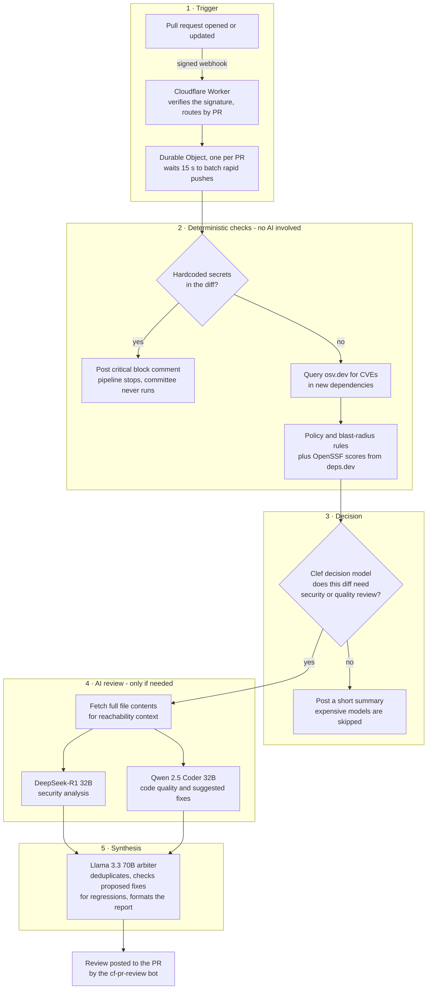

# Automated AI Code Review on Cloudflare Workers

An automated pull-request review agent that runs entirely on Cloudflare's free tier. When a pull request is opened on a repository where the `cf-pr-review` GitHub App is installed, a webhook triggers a pipeline that scans the diff for leaked credentials, checks new dependencies against live vulnerability data, and — when the change warrants it — runs a multi-model AI review that is posted back to the PR as a structured report. There is no server to operate: the agent is a Cloudflare Worker backed by a Durable Object, and it costs nothing to keep running.

This repository is the sandbox in which the agent was developed and verified. The open pull requests referenced below are real reviews produced by the deployed system during development; they double as a record of how each pipeline path behaves.

The project was built during ClawBuilders S1:E5, [Deploy AI Agents with Cloudflare](https://clawbuilder.club/events/s1/ep5/deploy-ai-agents-with-cloudflare), on top of the [ClawBuilders cloudflare-code-reviewer](https://github.com/Clawbuilders/cloudflare-code-reviewer) reference architecture, which takes its design cues from Alibaba's open-code-review. The changes I made to that architecture during deployment are listed under [Changes from the reference architecture](#changes-from-the-reference-architecture).

## How a review happens

1. GitHub delivers a signed webhook to a Cloudflare Worker, which verifies the HMAC-SHA256 signature and routes the event to a Durable Object scoped to that pull request.
2. The Durable Object waits 15 seconds, so rapid consecutive pushes collapse into a single review instead of several.
3. When the debounce alarm fires, the diff is fetched through the authenticated REST API and scanned for hardcoded credentials. A hit posts a critical block immediately and ends the pipeline.
4. If the diff is clean, new `package.json` dependencies are queried against osv.dev for known CVEs, checked against OpenSSF Scorecard data via deps.dev, and evaluated against policy rules (CI workflow, auth, or infrastructure changes; oversized PRs).
5. A decision model — Cloudflare's `@cf/cloudflare/clef` — judges whether the change needs a security review, a code-quality review, both, or neither. Low-signal changes get a short summary and skip the expensive models entirely. Real findings from the previous step always force a security review, so triage can add scrutiny but never remove it.
6. If deep review is warranted, DeepSeek-R1 (security) and Qwen 2.5 Coder (quality) analyze in parallel — the security model receives full file contents, not just the diff, so it can judge whether a flaw is actually reachable.
7. A Llama 3.3 70B arbiter merges everything: it deduplicates overlapping findings, verifies that proposed fixes introduce no new flaws, and formats the final report, which is posted as `cf-pr-review[bot]`. Every review is also written to a SQLite audit table inside the Durable Object.

Observed end-to-end times during development: a secret-blocked PR completes in about 16 seconds; a full committee review posts in roughly 35–55 seconds; a triage-skipped PR in about 16 seconds.

## Architecture

## Security pipeline

| # | Check | Kind | Behavior |
|---|---|---|---|
| 1 | Secret scan | heuristic | Regex ruleset modeled on gitleaks (AWS, GitHub, OpenAI, Stripe, Slack, npm, and other token shapes). Any hit blocks the PR immediately |
| 2 | osv.dev lookup | live API | New `package.json` dependencies are batch-queried for known CVEs — real advisory IDs, not guesses |
| 3 | File filter | heuristic | Lockfiles, YAML, markdown, and vendored/build paths never reach the models |
| 3.5 | Triage gate | decision model | `@cf/cloudflare/clef` decides which specialists run, with calibrated confidence values |
| 4 | Policy gate | heuristic | Flags CI workflow, auth, and infrastructure config changes; warns on oversized PRs |
| 5 | Reachability context | live API | Full file contents are fetched from the GitHub API so the security model can judge reachability, not just patterns |
| 6 | Regression check | model instruction | The arbiter is required to verify that proposed fixes introduce no secondary vulnerabilities |
| 7 | OpenSSF Scorecard | live API | New dependencies are scored via deps.dev (maintenance, review practices, branch protection) |

One honesty note worth stating plainly: Cloudflare Workers are V8 isolates and cannot execute native binaries, so this pipeline does not run the real gitleaks, semgrep, or OPA. The rows marked heuristic are deliberate re-implementations of those tools' rule sets in JavaScript; the rows marked live API call real public services. The worker's landing page renders the same breakdown.

## Model committee

| Model | Role |
|---|---|
| `@cf/cloudflare/clef` (27B decision model, Apache 2.0) | Triage gate: reads the diff state and returns calibrated probabilities for security/quality review and change category |
| `@cf/deepseek-ai/deepseek-r1-distill-qwen-32b` | Security specialist: reachability-oriented analysis with full-file context |
| `@cf/qwen/qwen2.5-coder-32b-instruct` | Quality specialist: correctness and style findings with suggested fixes |
| `@cf/meta/llama-3.3-70b-instruct-fp8-fast` | Lead arbiter: deduplication, regression checklist, final formatting |

All four are first-party Workers AI models billed in Neurons, so every call draws on the free daily allocation. The triage gate is what makes the economics work: in the verification run, Clef classified a notes-only change as documentation with a security confidence of 0.02 and a quality confidence of 0.09, and the committee never ran. A triage-only review costs on the order of a hundred Neurons; a full committee review consumes roughly 800–1,000.

## Free-tier operation

| Component | Plan |
|---|---|
| Cloudflare Worker (webhook ingress) | Free tier, 100k requests/day |
| Durable Object (SQLite-backed) | Free tier |
| Workers AI (all model calls) | 10,000 free Neurons/day, resets 00:00 UTC |
| GitHub App and webhooks | Free |
| osv.dev and deps.dev | Public APIs, no keys |

At roughly 800–1,000 Neurons per full committee review, the daily allocation covers about ten deep reviews plus hundreds of triage-only ones. If the allocation is exhausted, model calls fail with a 429 and reset at 00:00 UTC; the pipeline's response to that failure is described below.

## Example reviews

The pull requests in this repository were opened deliberately to exercise specific paths:

| PR | Change | Pipeline path | Result |
|---|---|---|---|
| [#1](https://github.com/akshatdodhiya/code-reviewer-test/pull/1) | Test fixtures containing inert, publicly documented example credentials | Secret gate | Critical block naming the credential types; the committee was never invoked (~16 s) |
| [#2](https://github.com/akshatdodhiya/code-reviewer-test/pull/2) | Known-vulnerable dependency pins, no secrets | Full committee, forced by live CVE findings | Synthesized review posted. This run predates the Clef migration, so the comment carries the visible fallback notice produced when the original architecture's paid triage model was unavailable (~36 s) |
| [#3](https://github.com/akshatdodhiya/code-reviewer-test/pull/3) | Vulnerable dependencies plus utility code with real defects | Full committee | Complete review with security, policy, dependency, supply-chain, and quality findings, plus a numbered fix list and corrected example code (~53 s) |
| [#4](https://github.com/akshatdodhiya/code-reviewer-test/pull/4) | Notes-only file | Triage gate | Classified as documentation (security confidence 0.02, quality confidence 0.09); specialists skipped (~16 s) |

The credential strings in PR #1 are published example values and were never valid.

## Changes from the reference architecture

This project is a deployment of an existing open architecture, with the following work of my own on top of it:

- **End-to-end deployment.** Worker and Durable Object deployment, GitHub App registration with least-privilege permissions (Contents: read; Pull requests: read/write), PKCS#8 private-key conversion, secret management via Wrangler, webhook signature validation, and App installation — verified by exercising every pipeline path with targeted pull requests rather than trusting that a deployment succeeded.
- **Removal of the only paid dependency.** The reference design routes triage through `typesafe/jev`, a third-party decision model billed via AI Gateway credits with no free tier. I replaced it with `@cf/cloudflare/clef` — Cloudflare's first-party, Apache-2.0-licensed decision model, released the same day this project was built — while keeping a text-model fallback and a fail-open tier beneath it, so a triage-layer failure can never silently drop a review. Every model call in the pipeline now runs inside the free Neurons allocation.
- **Fix for truncated reviews.** The arbiter inherited the platform's 256-token default output cap, which cut reviews off mid-sentence. Raising the cap to 2048 tokens produces complete reports.
- **Private-repository verification.** Diffs are fetched through the authenticated REST API with the App installation token, because GitHub's `.diff` web route rejects App tokens on private repositories. The sandbox repository here was private throughout development, so every review was produced under exactly those conditions.

## Design notes

- Deterministic checks run before any model call. A leaked credential never depends on a language model noticing it.
- Triage can only add scrutiny. Real findings from osv.dev or the policy gate force a security review regardless of what the decision model says.
- Degradation is visible by design. If a tier fails, the pipeline fails open — it runs the full committee rather than skipping — and the posted review states which tier was unavailable.
- One Durable Object per pull request gives natural per-PR serialization, and the 15-second alarm debounce means many pushes produce one review.
- Model inputs are bounded (diff slice length, file count, context size) to keep latency and Neuron spend predictable regardless of PR size.

## Limitations

- The secret scan is pattern-based, not entropy-based; it catches well-shaped secrets, not all secrets.
- Dependency analysis parses `package.json` only (no lockfiles) and caps at ten packages per run; full-file context is capped at two files of 4,000 characters.
- osv.dev findings are provided to the arbiter rather than to the security specialist, so dependency advisories and code-level analysis are synthesized rather than cross-examined.
- If a specialist model call itself throws, that review is not posted; the failure is logged via `wrangler tail` and is the one bounded gap in the fail-open chain.
- Everything runs on free tiers. Sustained volume beyond roughly ten committee reviews per day exhausts the daily Neuron allocation until it resets at 00:00 UTC.

## Credits

Built during ClawBuilders S1:E5 — [Deploy AI Agents with Cloudflare](https://clawbuilder.club/events/s1/ep5/deploy-ai-agents-with-cloudflare).

Based on the [ClawBuilders cloudflare-code-reviewer](https://github.com/Clawbuilders/cloudflare-code-reviewer) reference architecture, which credits Alibaba's open-code-review as its design inspiration. The deployment changes listed above are my own.

Agent: `cf-pr-review[bot]` (GitHub App ID 5156105) · Worker: `cloudflare-code-reviewer.akshat-personal.workers.dev`
